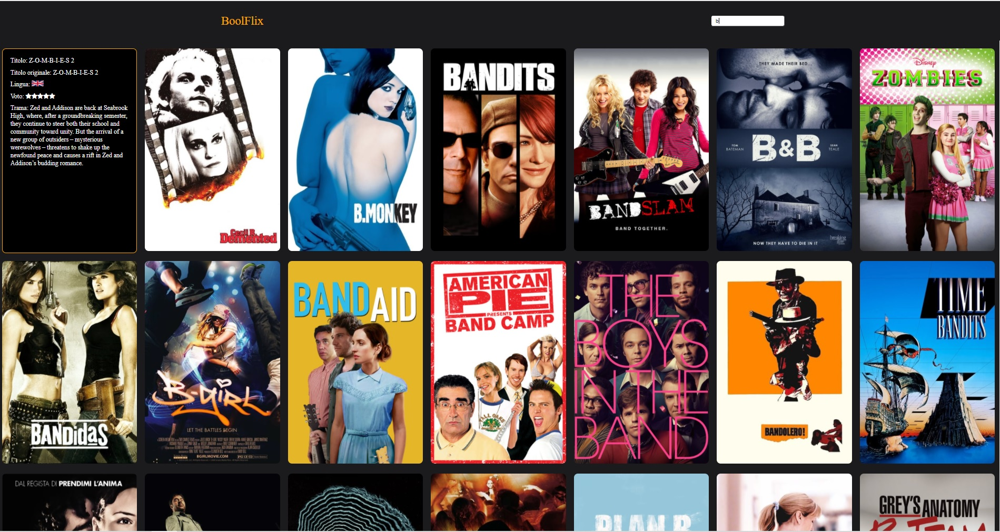

# Boolflix

Creazione responsive di Web App per la visualizzazione di una libreria di film e serie tv. 
Il progetto è stato gestito per mezzo di chiamate AJAX al database di TMDB.

Tech: HTML/CSS/JavaScript(VUE.js) 

## Funzionalità

+ Ricerca film/serie tv
+ Visualizzazione di informazioni quali titolo, lingua, voto e trama on hover

## Credits

https://www.themoviedb.org/
